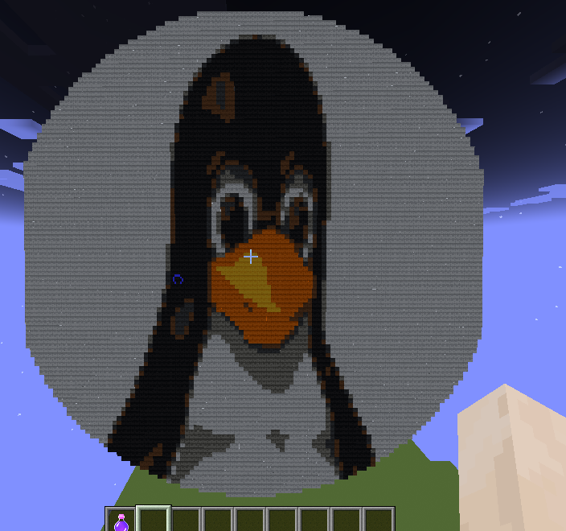
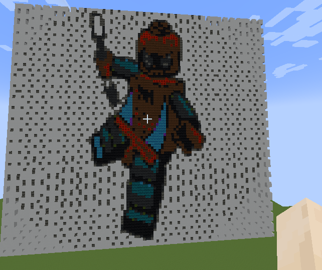

# Minecrafat image printer

## Description
use this program to print your picture in minecraft world, it's a 2D printer, making this program to create 3D objects, is TODO (not so hard to do)


## Usage
to use this program you need some prerequisite tools like:
- docker
- linux
- make
- java (not very important, it will comes in docker containers)


### Download BuildTools.jar

you need to download the BuildTools.jar using
```sh
$ curl -o BuildTools.jar https://hub.spigotmc.org/jenkins/job/BuildTools/lastSuccessfulBuild/artifact/target/BuildTools.jar
```

When downloading complete build the `server.jar` using

```sh
$ java -jar BuildTools.jar --rev 1.18.2
```

this will make a file called `spigot-1.18.2.jar`, you need to move it to server_templates
```sh
$ mv spigot-1.18.2.jar server_templates/server.jar
```

### Downloading RaspberryJuice.jar

Download the specific version of jar file in [GITHUB](https://github.com/zhuowei/RaspberryJuice/blob/master/jars/)

Recommended to download the `1.12.x` version
and place the jar file in `server_templates/plugins` directory

## Build and run server

for building the server: build the docker image with following commands
```sh
$ make
Building the minecraft server...
docker build . -t minecraft_printer
```

if everthings goes well you should see this message at end "Server just built, to run the server use: 'make run'"

to our image just built, to run it use:
```sh
$ make run
Running the minecraft server...
docker run --publish="25565:25565" --publish="4711:4711" --rm --name "minecraft_printer" minecraft_printer
```

port *25565* is use for the minecraft world server
so if you want to join to the world just use the server ip (propably 127.0.0.1) and port "25565" like this `127.0.0.1:25565`

and port *4711* is used for RaspberryJuice plugin (this is the plugin that our python program interacts with that)

and that's it, if you see the message ("Done (50.5620)! For help, type "help") in server logs you're done
the server is *running* at port *25565* and *raspberry* at port *4711*

## Testing

in another computer/mobile join to the world with the "server:ip", you can do it in the:

> note that to get the server ip in the same network > `ip addr` (192.168.X.X) ??

```sh
$ ip addr show wlp3s0
wlp3s0: <BROADCAST,MULTICAST,UP,LOWER_UP> mtu 1500 qdisc noqueue state UP group default qlen 1000
    ...
    inet 192.168.1.5/24 brd 192.168.1.255 scope global dynamic noprefixroute wlp3s0
    ...
```

> Multiplayer>Direct Connection>(set 192.168.1.5:25565)>Join Server

## Run the python script
for install the python requirements do the following steps

```sh
$ python3 -m venv venv
$ source venv/bin/activate
$ pip3 install -r requirements.txt
```

and print your image like this

```sh
$ ./printer.py --image Tux.png --resize --width 50 --height 80
```

if you want to print the actual image size, remove the `--resize, --width, --height` 


in the device that is joined to world check out the result...





# Bugs

if you find any bugs, please report it to me as *issue*, or want to improve codes or something make a pull request